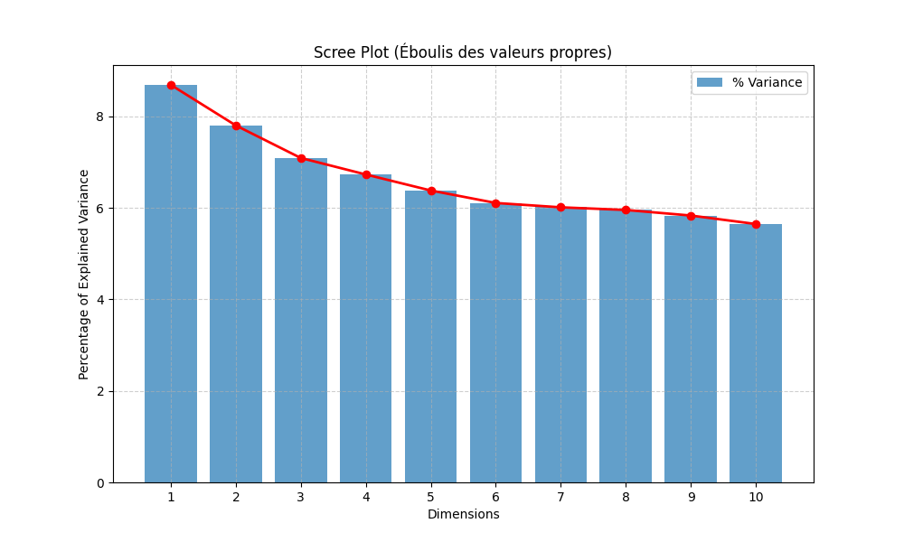
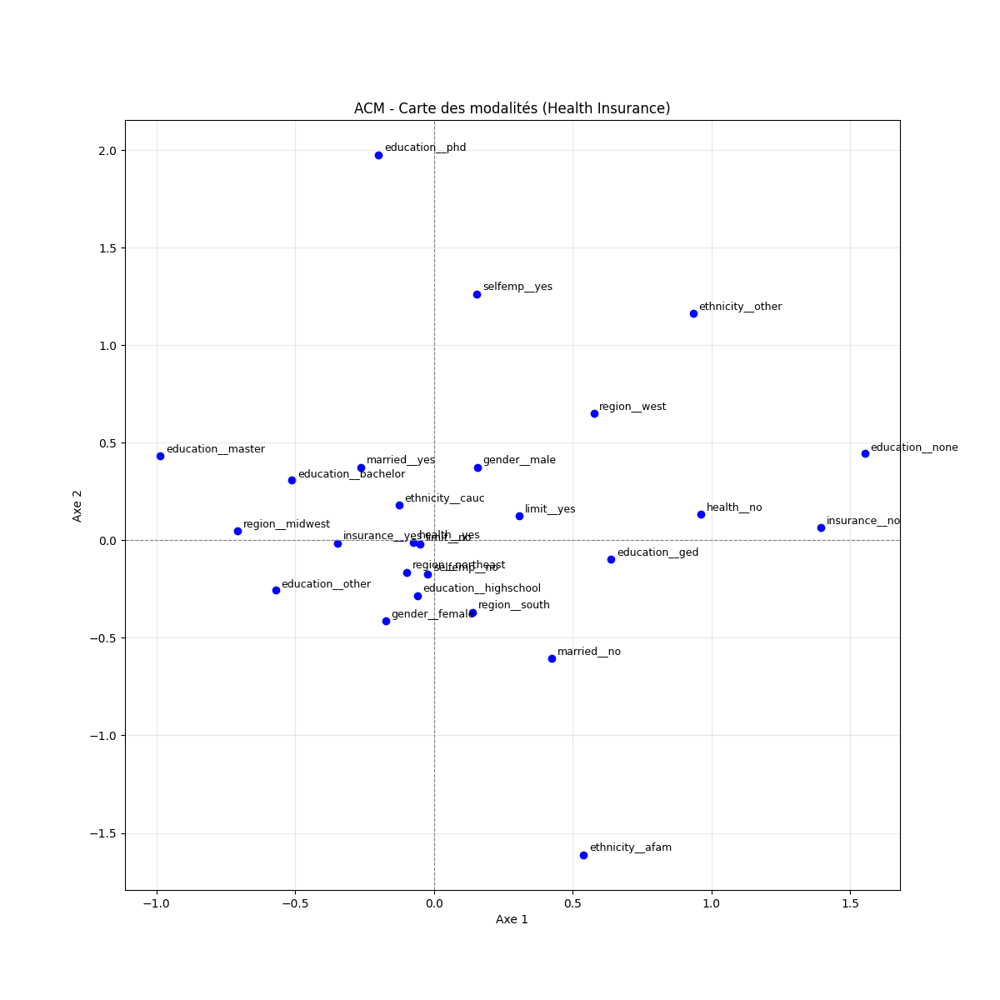

# Rapport d'Analyse des Données : Étude "Health Insurance" par ACM

**2CS SIL Année 2025/2026 ANAD TD 4 ACM**

**Binôme :** Khiali Imad & Kadou Amine 
**Date :** 31 Décembre 2025

---

## 1. Introduction et Objectifs

L'objectif de cette étude est d'explorer les relations entre les caractéristiques socio-démographiques, professionnelles et de santé d'une population de **8 802 individus**. 

Nous utilisons pour cela une **Analyse des Correspondances Multiples (ACM)**. Cette méthode factorielle est particulièrement adaptée car notre jeu de données est majoritairement composé de variables qualitatives (catégorielles). Elle nous permettra de résumer l'information, de visualiser les associations entre modalités et d'identifier des profils types d'individus.

## 2. Data Sample

Aperçu des premières lignes du jeu de données `HealthInsurance` :

| health | limit | gender | insurance | married | selfemp | region | ethnicity | education |
| :--- | :--- | :--- | :--- | :--- | :--- | :--- | :--- | :--- |
| yes | no | male | yes | yes | no | south | cauc | master |
| yes | no | female | yes | yes | no | west | cauc | bachelor |
| no | yes | male | no | no | no | northeast | afam | none |
| yes | no | male | yes | yes | no | west | cauc | bachelor |
| yes | no | male | yes | yes | no | south | cauc | bachelor |

## 3. Eigenvalues

| Dim | Variance | % of var. | Cumulative % of var. |
|---|---|---|---|
| Dim.1 | 0.164 | 8.688 | 8.688 |
| Dim.2 | 0.147 | 7.802 | 16.490 |
| Dim.3 | 0.134 | 7.090 | 23.580 |
| Dim.4 | 0.127 | 6.730 | 30.311 |
| Dim.5 | 0.120 | 6.376 | 36.687 |

En ACM, nous ne considérons que les valeurs propres supérieures à la moyenne égale à $1/p = 1/9 \approx 0.11$. Les 5 premiers axes seront pris en compte pour l'interprétation. Le taux d'inertie cumulé des 2 premiers axes est de 16.49%.

## 4. Multiple Correspondence Analysis Results for variables

Tableau des contributions et qualités de représentation ($Cos^2$) des modalités sur les premiers axes.

| Variable_Category | Dim 1 Cos2 | Dim 2 Cos2 | Dim 1 Contrib (%) | Dim 2 Contrib (%) |
|---|---|---|---|---|
| **insurance_no** | 0.488 | 0.007 | 26.486 | 0.442 |
| **education_none** | 0.366 | 0.035 | 21.642 | 2.303 |
| **ethnicity_afam** | 0.031 | 0.309 | 1.815 | 20.450 |
| **selfemp_yes** | 0.001 | 0.215 | 0.052 | 14.263 |
| **region_west** | 0.052 | 0.195 | 2.729 | 11.307 |
| **health_no** | 0.144 | 0.000 | 9.063 | 0.012 |
| **married_no** | 0.139 | 0.167 | 5.813 | 7.772 |
| **ethnicity_other** | 0.009 | 0.102 | 0.557 | 7.389 |
| **gender_female** | 0.013 | 0.185 | 0.449 | 7.337 |
| **insurance_yes** | 0.488 | 0.007 | 6.573 | 0.110 |

## 5. Categorical variables (eta2)

| Variable | Dim.1 | Dim.2 | Dim.3 |
|---|---|---|---|
| **health** | 0.144 | 0.000 | 0.308 |
| **limit** | 0.029 | 0.000 | 0.450 |
| **gender** | 0.013 | 0.185 | 0.001 |
| **insurance** | 0.488 | 0.007 | 0.054 |
| **married** | 0.139 | 0.167 | 0.125 |
| **selfemp** | 0.001 | 0.215 | 0.000 |
| **region** | 0.141 | 0.212 | 0.101 |
| **ethnicity** | 0.042 | 0.386 | 0.083 |
| **education** | 0.479 | 0.153 | 0.083 |

## 6. Les figures

### (a) Scree Plot
Graphique des valeurs propres (éboulis).


### (b) Variable categories (Biplot)
Représentation des modalités dans le plan factoriel 1-2.


### (c) Contributions
Les contributions montrent que l'axe 1 est dominé par l'assurance et l'éducation, tandis que l'axe 2 est lié à l'ethnicité et au statut professionnel.

## 7. Analyse des résultats

• **Qualité de représentation** :
Les modalités `insurance`, `education` et `ethnicity` sont les mieux représentées sur les premiers axes (voir tableau Cos2).

• **Contributions** :
Les contributions sont comparées à la moyenne $1/26 \approx 3.8\%$. (Les symboles (+) ou (-) indiquent la position sur l'axe).

*   **Axe 1** : Les modalités qui ont fortement contribué à la construction de l'axe 1 sont :
    *   `insurance_no` (+), `education_none` (+), `health_no` (+), `married_no` (+)
    *   `insurance_yes` (-)

*   **Axe 2** : Les modalités qui ont fortement contribué à la construction de l'axe 2 sont :
    *   `selfemp_yes` (+), `region_west` (+), `ethnicity_other` (+), `education_phd` (+)
    *   `ethnicity_afam` (-), `married_no` (-), `gender_female` (-), `region_south` (-)

• **Synthèse** :
L'axe 1 oppose les individus assurés (négatif) aux individus non assurés, sans éducation et en mauvaise santé (positif). L'axe 2 distingue un profil spécifique d'indépendants de l'ouest (positif) par rapport à un profil plus démographique (femmes, afro-américains, sud) (négatif).

## 8. Conclusion

L'analyse met en évidence une structure principale (Axe 1) liée à la précarité socio-économique (absence d'assurance, faible éducation) et une structure secondaire (Axe 2) liée à des profils démographiques spécifiques (ethnicité, indépendants). Nous conseillerions aux décideurs de cibler les populations sans diplôme pour améliorer la couverture santé.

---
## Annexe : Code Python utilisé

Le code source complet et les fichiers du projet sont disponibles sur le dépôt GitHub suivant :  
**[https://github.com/Amine2240/analyse-ACM](https://github.com/Amine2240/analyse-ACM)**

### Aperçu du script principal (`preparation.py`)

```python
import pandas as pd
import prince
import matplotlib.pyplot as plt

# 1. Chargement
df = pd.read_csv("HealthInsurance.csv")
df_acm = df.select_dtypes(include=['object', 'category'])

# 2. ACM
mca = prince.MCA(n_components=2, engine='sklearn')
mca = mca.fit(df_acm)

# 3. Résultats
print(mca.eigenvalues_summary)
coords = mca.column_coordinates(df_acm)

# 4. Graphique
mca.plot(df_acm)
plt.show()
```
